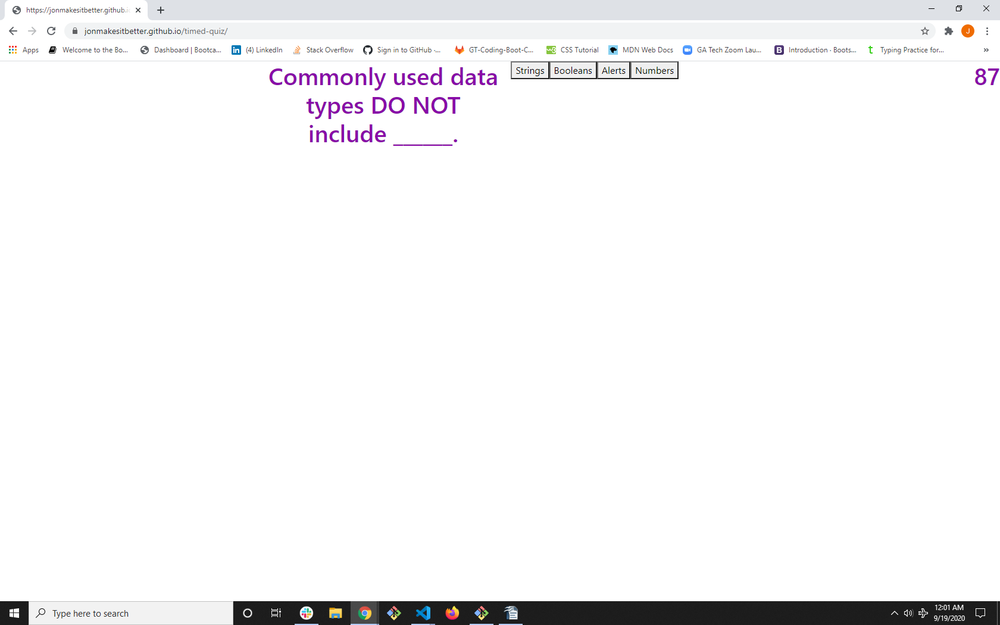

# Timed Quiz

This timed quiz is a simple series of questions about
programming fundamentals. 

## Usage

Upon clicking the start button, a countdown timer will appear in the upper right hand corner of the screen and the user will be presented with a question about programming. After clicking an answer button, 
another question will appear, and so on until there are no more questions.

The link can be found [here.](https://jonmakesitbetter.github.io/timed-quiz/)

